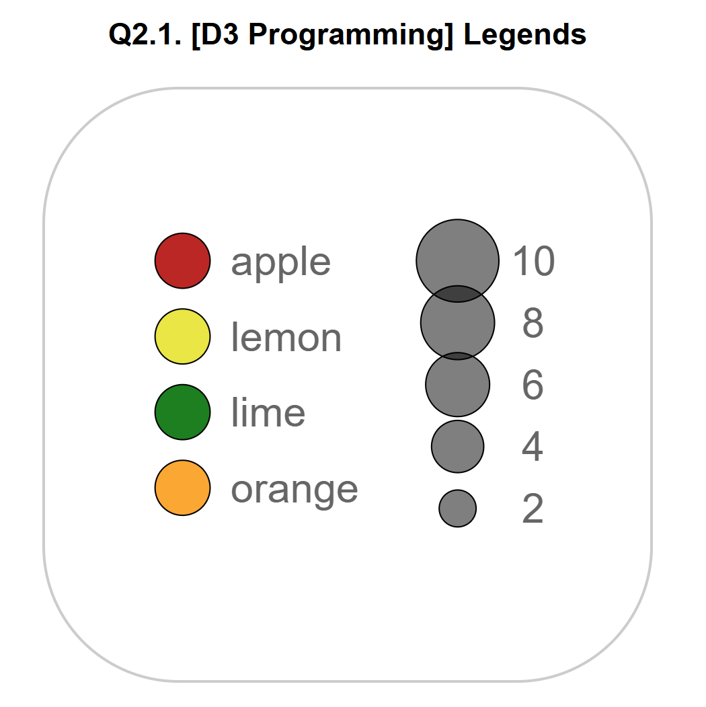

# Colour and Size Legends Visualization

This project focuses on creating a visualization using D3.js that generates two distinct legends: one for categorical data and another for quantitative data. Specifically, it involves the creation of a colour legend and a size legend to represent different data types, utilizing data visualization techniques in D3.js.

## Overview
The visualization includes two legends:
- **Colour Legend**: Represents different categories of fruits using colour-coded circles, each labeled with a fruit name.
- **Size Legend**: Represents quantitative values with circles of different sizes, accompanied by numerical labels.

This project is part of an ongoing exploration of data visualization techniques and aims to practice creating reusable D3 components based on previous Tutorials 0, 1, 2, and 3.

### Key Features
- **Colour Legend**: Uses D3.js to create a categorical legend for four different fruits: apple, lemon, lime, and orange.
- **Size Legend**: Creates a quantitative legend with circles that represent different numerical values (2, 4, 6, 8, 10).
- **Reusable Components**: Implements two reusable functions (`colourLegend` and `sizeLegend`) that can be used in various D3 visualizations.
- **SVG Canvas**: Defined using a responsive `viewBox` to ensure the visualization is adaptable to different screen sizes.

## Data
The visualization does not rely on an external dataset; instead, it uses fixed categorical values (`apple`, `lemon`, `lime`, `orange`) and numerical values (`2, 4, 6, 8, 10`) to demonstrate the use of legends in D3.js.

### Colour Legend Data:
- Categories: `apple`, `lemon`, `lime`, `orange`
- Colours: `#c11d1d` (red), `#eae600` (yellow), `green`, `orange`

### Size Legend Data:
- Quantitative values: `2, 4, 6, 8, 10`
- Represented as circles of increasing size, with a fill color of `rgba(0, 0, 0, 0.5)`

## Steps to Create the Visualization
1. **Set Up the SVG Canvas**:
   - Defined an SVG element with a responsive `viewBox` attribute to adjust based on the container size.
   - Configured margins and padding to ensure the chart is centered.

2. **Colour Legend Implementation**:
   - Created a colour scale using `d3.scaleOrdinal()` for categorical data.
   - Appended a group (`g`) to the SVG to create the colour legend, with parameters like `circleRadius`, `spacing`, and `textOffset` for customization.

3. **Size Legend Implementation**:
   - Used a `d3.scaleSqrt()` scale to represent quantitative data with varying circle sizes.
   - Appended a group (`g`) to the SVG for the size legend, setting properties such as `numTicks`, `circleFill`, and `textOffset` for clear representation.

4. **Styling**:
   - Used a CSS stylesheet (`styles.css`) to style the text, circles, and the SVG canvas.
   - Centered the SVG on the page using flexbox properties.

## Screenshot (Final Output)

The visualization successfully conveys the categorical data (fruits) through color and the quantitative data through circle sizes. The reusable D3 components ensure that these legends can be applied in other visualizations effectively.

## Usage
To view the colour and size legends visualization:
1. Clone this repository.
2. Open the `index.html` file in your browser.
3. Ensure all files (`index.html`, `styles.css`, `colourLegend.js`, `sizeLegend.js`, `script.js`) are in the same directory.

## Requirements
- **D3.js v7**: The visualization uses D3.js version 7.
- **HTML/CSS**: Basic HTML (`index.html`) and CSS (`styles.css`) are used to structure and style the page.

## Conclusion
This project demonstrates the process of creating reusable legend components in D3.js, covering both categorical and quantitative data. It highlights how to use D3 scales effectively and emphasizes the importance of creating adaptable and responsive SVG visualizations.